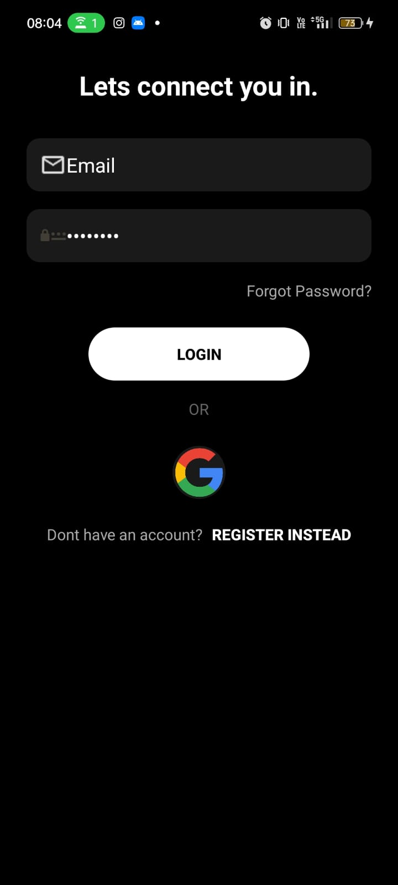
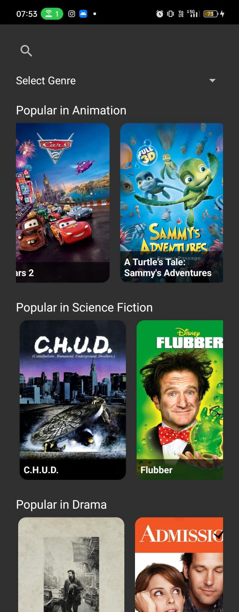
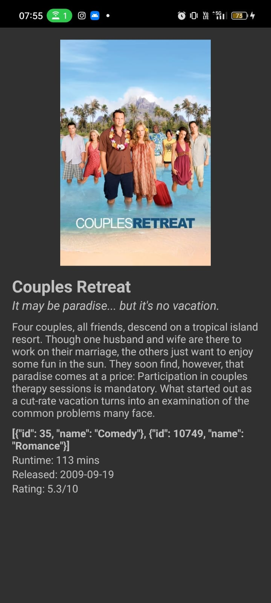

# Movie
A full-stack movie recommendation system using Android (Kotlin) + FastAPI, with Retrofit API calls, CSV-based filtering, and genre-based search and display.

#  Movie Recommendation App

This is a full-stack movie recommendation system built using:
-  **FastAPI** (Python) for backend APIs
-  **Android (Kotlin)** for mobile frontend
-  CSV metadata for recommendation logic

---

##  Features

-  Random movie recommendations
-  Search movies by title
-  Genre-based movie filtering
-  Movie detail screen with overview, rating, release date, and more
-  Fallback image handling if posters are missing
-  API integration using Retrofit (with ngrok tunnel for local dev)

---

##  Screenshots
<h3>🏠 Home Screen</h3>


<h3>🎬 Movie Detail</h3>



###  Welcome Screen


###  Login Screen


###  Register Screen


###  Home Screen


###  Home Screen


###  Filter Screen


###  Search Screen



##  Backend (FastAPI)

###  Key Endpoints

| Method | Endpoint | Description |
|--------|----------|-------------|
| `GET`  | `/random_recommendations` | Returns grouped random recommendations |
| `GET`  | `/recommend/{title}` | Recommends similar movies by title |
| `GET`  | `/movie/{movie_id}` | Returns movie details |
| `GET`  | `/genre/{genre_name}` | Returns movies filtered by genre (supports multiple genres) |
| `GET`  | `/search/{query}` | Returns movies whose titles match the search query |

###  Dataset
- Uses a CSV file containing movie metadata (title, id, genres, overview, etc.)
- Genres are nested lists like:
  ```json
  [{"id": 16, "name": "Animation"}, {"id": 10751, "name": "Family"}]

  ```
  
### Poster Fetching
- Integrates with TMDB-like API (or local images) to fetch poster URLs.

- Includes fallback logic if poster is missing.

🔧 Run Instructions

```bash
uvicorn main:app --reload
```

### Android App (Kotlin)
 Retrofit Setup- 
- Base URL is connected to the ngrok tunnel from backend

-Handles errors and timeouts gracefully

# Uses Retrofit interfaces:

- getRandomRecommendations()

- getRecommendations(title)

- getMovieDetail(movie_id)

- getMoviesByGenre(genre_name)

- searchMovies(query)

###  UI Structure
1. HomeActivity: Displays search bar and sections (genre + random)

2. SectionAdapter: Handles horizontal movie lists grouped by genre

3. MovieAdapter: Handles individual movie cards

4. MovieDetailActivity: Displays full info on click

###  Error Handling
- Displays Toast messages for failed fetches

- Logs Retrofit exceptions

### Screenshots
- Add your emulator or physical device screenshots here

### Future Improvements
- Add watch history


### Author  : Developed by PriiiAiVerse

 
 ### Folder Structure
```css

📦backend/
 ┣ main.py
 ┣ recommendation_utils.py
 ┣ movie_data.csv

📦app/
 ┣ adapter/
 ┃ ┣ SectionAdapter.kt
 ┃ ┣ MovieAdapter.kt
 ┣ model/
 ┃ ┣ Movie.kt
 ┃ ┣ Section.kt
 ┃ ┣ RecommendationResponse.kt
 ┣ network/
 ┃ ┣ RetrofitClient.kt
 ┃ ┣ ApiService.kt
 ┣ HomeActivity.kt
 ┣ MovieDetailActivity.kt

```
💡 Tech Stack
Android (Kotlin, Retrofit, RecyclerView)

FastAPI (Python)

CSV + Pandas

Glide (image loading)

TMDB / ngrok for testing

